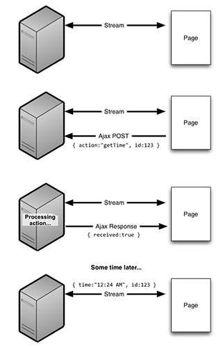

jquery.eventedAjax plugin
=========================

With the introduction of a new generation of non-blocking, event-driven web server such as NodeJS, Twisted, EventMachine,
the typical approach of doing Ajax requests for web-page interactivity is losing it's place. An Ajax request requires an
HTTP response which contains the data it's requested - this is of course, blocking other requests and defeating the purpose
of your shiny new non-blocking web server.

The *jquery.eventedAjax* plugin provides a solution to this. It provides a similar interface as the built in *jquery.ajax*
method, but it provides an additional parameter, *futureOptions*.
This *futureOptions* object contains the configuration for the triggering of a future event, raised from a stream (such as
a websocket or comet stream).

Usage
-----

[Being written]

What your server needs to do to make this work
----------------------------------------------

The *jquery.eventedAjax* plugin needs a unique identifier to match up an outgoing Ajax post and an incoming stream message.
This ID has been implemented in the plugin as a JSON field called *clientMsgID*. 

Any response sent over the stream must include this field, clientMsgID, which when received by your stream's JavaScript 
new-message handler must be raised as a jQuery custom event through the use of the 
$.futureOptions.eventNotificationElement.trigger("{myEventName}.{clientMsgId}") method (replaced with real values obviously).

Credits
-------
* Author: Adam Burmister - http://flog.co.nz http://superherolabs.com - @AdamBurmister
* Development sponsored by Mojolly.com